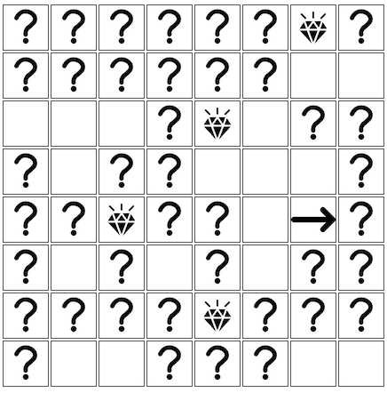

# Diamond Sweeper

## Problem Statement

The goal of this exercise is to build a game.

The rules of the game are as follows:

* The game board has 8x8 squares (initially, all represented by question marks)
* There are 8 diamonds hidden on the board, each diamond behind one of the squares
* When the user clicks on a square
    * If the square was hiding a diamond, the diamond appears
    * Otherwise, the square is opened, and blank
* The game ends when all diamonds are found. The user's score is the number of squares still left unturned.

## Advanced: Adding Hints

Part II of this problem adds the ability to add hints to empty squares

* When the user clicks on a square
    * If the square was not a diamond, then an arrow appears, pointing towards the nearest diamond
    * Any arrows that were previously show become hidden

## Starter App

Provided is a simple application which can be used as a starter kit. It contains a simple UI for the above problem. Feel free to add any libraries or frameworks that you believe can help. Unit tests for any logic that the application contains is a bonus.

Requirements:

* node.js (the app was built against v8.1.4, but any node > 6 should work)
* npm

To start the Application:

* Install the dependencies (via `yarn install` or `npm install`)
* Compile Assets: `npm run compile`
* Start the webserver: `npm start`
* Visit `http://localhost:3000` to see the application

If you have done the above steps correctly, you should see the below

If you make a change, run the last two steps above to see it reflected.

## Bonus Sections

You may also choose to try some of the bonus parts of this problem:

1. (UI) - Improve the board to semantic html. The default HTML provided uses tables.
2. (UI) - Make the UI responsive.
3. (Javascript) - Support the ability to save your progress, and load your last save.
4. (Javascript) - Cover logic in your application with meaningful tests
5. (Infra) - Get hot reloading working
6. (Infra) - Get asset pipelining and minification working
